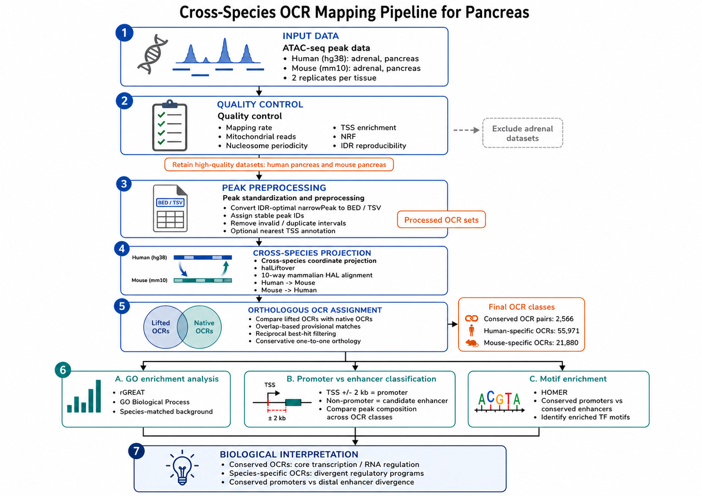

# Adrenal-Pancreas Open Chromatin Comparative Project

Comparative epigenomics workflow for identifying conserved and species-specific open chromatin regions (OCRs) between human and mouse pancreas, then connecting those regions to biological processes, regulatory classes, and candidate transcription factors.

**Project Citation:** See [How to Cite](#how-to-cite) for attribution information.

## Table of Contents
- [Project Scope](#project-scope)
- [Workflow Overview](#workflow-overview)
- [Repository Organization](#repository-organization)
- [Quick Start](#quick-start)
- [Detailed Task Workflows](#detailed-task-workflows)
- [Input and Output Reference](#input-and-output-reference)
- [Configuration Guide](#configuration-guide)
- [Troubleshooting](#troubleshooting)
- [Tools Used](#tools-used)
- [Authors & Citation](#authors--citation)

## Project Scope

This repository contains a complete comparative epigenomics pipeline for six sequential analysis tasks:

1. **Task 2**: Cross-species OCR mapping (HAL liftover + reciprocal best-hit pairing)
2. **Task 3**: Conserved and species-specific OCR partitioning from Task 2 outputs
3. **Task 4**: GO biological process enrichment using rGREAT
4. **Task 5**: Promoter vs enhancer classification (TSS +/- 2 kb rule)
5. **Task 6**: Transcription factor motif analysis using HOMER

Phase 1 QC deliverables are stored in `results/qc/` and related notes are in `docs/`.

## Workflow Overview



**Figure 1.** Overview of the cross-species pancreas OCR workflow used in this repository, from ATAC-seq peak input and quality control through OCR mapping, downstream GO analysis, promoter/enhancer classification, motif enrichment, and biological interpretation.

*Figure note: The schematic artwork for this figure was generated with ChatGPT image generation from OpenAI and then curated for this repository. See [OpenAI's image generation documentation](https://platform.openai.com/docs/guides/images/image-generation) and [ChatGPT image generation help](https://help.openai.com/en/articles/8932459-image-generation).*

## Repository Organization

```text
.
├── config/                      # Runtime configuration files
├── docs/                        # Methods, progress reports, project notes
├── scripts/                     # Executable scripts for Tasks 2-6
├── src/cross_species_ocr/       # Python package for Task 2 mapping pipeline
├── tests/                       # Unit tests
├── results/                     # Analysis outputs (tables, figures, mapping, GO, etc.)
├── data/                        # Local copy/cache area (ignored by git)
├── README.md
├── requirements.txt
└── .gitignore
```

## Quick Start

### Clone Repository

```bash
git clone https://github.com/BioinformaticsDataPracticum2026/adrenal-pancreas-open-chromatin
cd adrenal-pancreas-open-chromatin
```

### Setup Environment

#### Python Dependencies

```bash
# Create and activate virtual environment
python3 -m venv .venv
source .venv/bin/activate

# Install Python packages
pip install -r requirements.txt
```

**Note:** If you encounter installation issues, see the [Troubleshooting](#troubleshooting) section below.

#### R 4.5.1 Setup (Required for Tasks 4 & 5)

Install R version 4.5.1 from [CRAN](https://cran.r-project.org/):

1. Go to https://cran.r-project.org/ and download R 4.5.1 for your OS
2. Install R following the official instructions
3. Open an R terminal session and run the commands below

For Bioconductor packages, the `3.22` release maps to `R 4.5.x`. Install required packages:

```r
# Install BiocManager
if (!require("BiocManager", quietly = TRUE)) {
  install.packages("BiocManager")
}

# Set Bioconductor version
BiocManager::install(version = "3.22")

# Install CRAN packages
install.packages(c(
  "ggplot2",
  "dplyr",
  "stringr",
  "scales",
  "patchwork",
  "tidyr"
))

# Install Bioconductor packages
BiocManager::install(c(
  "rGREAT",
  "GenomicRanges",
  "GenomeInfoDb",
  "rtracklayer"
))
```

**Task-specific R packages:**
- **Task 4**: `ggplot2`, `dplyr`, `stringr`, `rGREAT`, `GenomicRanges`, `GenomeInfoDb`, `rtracklayer`
- **Task 5**: `ggplot2`, `dplyr`, `scales`, `patchwork`, `tidyr`, `GenomicRanges`, `GenomeInfoDb`, `rtracklayer`

#### External Tools

The pipeline requires these command-line tools to be available in your PATH or specified in config files:

| Tool | Purpose | Installation |
|------|---------|--------------|
| [halLiftover](http://compbio.soe.ucsc.edu/cactus/hal/) | Cross-species coordinate lifting (Task 2) | Install via [UCSC Genome Browser](http://compbio.soe.ucsc.edu/cactus/hal/) or compute cluster modules |
| [bedtools](https://bedtools.readthedocs.io/) | Genomic interval operations (Tasks 2-3) | `conda install bedtools` or `apt-get install bedtools` |
| [HOMER](http://homer.ucsc.edu/) | Motif enrichment analysis (Task 6) | See [HOMER installation guide](http://homer.ucsc.edu/software/installation.html) |

## Configuration Guide

### Task 2: Cross-Species OCR Mapping Configuration

Before running any tasks, configure `config/task2_pancreas_mapping.yaml`. This file sets all input and output paths for the pipeline.

**Key configuration parameters:**

```yaml
# Project and data paths
project_root: /ocean/projects/bio230007p/aguda1/adrenal-pancreas-open-chromatin
data_root: /ocean/projects/bio230007p/ikaplow
results_dir: results/
logs_dir: results/logs/

# Input ATAC-seq peak files (narrowPeak format)
human_peaks_file: /path/to/human_pancreas_peaks.narrowPeak
mouse_peaks_file: /path/to/mouse_pancreas_peaks.narrowPeak

# Genome annotation files (GTF format)
human_gtf: /path/to/human.gtf
mouse_gtf: /path/to/mouse.gtf

# HAL alignment file (cross-species synteny)
hal_file: /path/to/cross_species.hal

# Optional: Path to halLiftover binary if not in PATH
hal_liftover_bin: /path/to/halLiftover
```

**How to find these files:**
- **ATAC-seq peaks**: Located in `/ocean/projects/bio230007p/ikaplow/HumanAtac/` and `/ocean/projects/bio230007p/ikaplow/MouseAtac/` (or your local data directory)
- **GTF files**: Located in `/ocean/projects/bio230007p/ikaplow/HumanGenomeInfo/` and `/ocean/projects/bio230007p/ikaplow/MouseGenomeInfo/`
- **HAL alignment**: Located in `/ocean/projects/bio230007p/ikaplow/Alignments/` (10-way whole genome alignment)

**Example configuration section:**
```yaml
human_peaks_file: /ocean/projects/bio230007p/ikaplow/HumanAtac/human_pancreas_peaks.narrowPeak
mouse_peaks_file: /ocean/projects/bio230007p/ikaplow/MouseAtac/mouse_pancreas_peaks.narrowPeak
human_gtf: /ocean/projects/bio230007p/ikaplow/HumanGenomeInfo/hg38.gtf
mouse_gtf: /ocean/projects/bio230007p/ikaplow/MouseGenomeInfo/mm10.gtf
hal_file: /ocean/projects/bio230007p/ikaplow/Alignments/10plusway-master.hal
```

## Detailed Task Workflows

### Task 2: Cross-Species OCR Mapping

**Purpose:** Map open chromatin regions (OCRs) between human and mouse pancreas using reciprocal best-hit matching.

**Pipeline steps:**
1. Read and standardize narrowPeak files into clean BED format
2. Annotate peaks with nearest genes and TSS distances
3. Lift OCR coordinates between species using halLiftover
4. Score overlaps between lifted and target-species OCRs
5. Identify reciprocal best-hit pairs as orthologous OCRs
6. Classify remaining OCRs as non-orthologous (reasons: no_liftover, no_target_overlap, non_reciprocal_best_hit)
7. Generate summary tables and visualizations

**Why reciprocal best hits?** This conservative approach yields clean orthologous mappings while avoiding over-claiming conservation when one lifted OCR overlaps multiple candidates.

**Running Task 2:**

```bash
# 1. Review and edit the configuration file
vi config/task2_pancreas_mapping.yaml

# 2. Discover input files (validate config without running mapping)
PYTHONPATH=src python3 scripts/run_task2_pancreas_mapping.py discover \
  --config config/task2_pancreas_mapping.yaml

# 3. Run full mapping pipeline
PYTHONPATH=src python3 scripts/run_task2_pancreas_mapping.py run \
  --config config/task2_pancreas_mapping.yaml

# Optional: Run preprocessing only (skip HAL liftover)
PYTHONPATH=src python3 scripts/run_task2_pancreas_mapping.py run \
  --config config/task2_pancreas_mapping.yaml --skip-mapping
```

### Task 3: Conserved vs Species-Specific OCRs

**Purpose:** Partition OCRs into conserved (found in both species) and species-specific categories.

**Inputs:**
- Lifted peak coordinates from Task 2
- Orthologous pair information from Task 2

**Running Task 3:**

```bash
bash scripts/task_3_compare_ocrs_v3.sh
```

The script automatically uses Task 2 outputs. It merges fragmented liftover artifacts and identifies conserved regions through reciprocal overlap analysis.

### Task 4: GO Biological Process Enrichment

**Purpose:** Identify enriched Gene Ontology (GO) Biological Process terms associated with species-specific and conserved OCRs using rGREAT.

**Inputs:**
- Species-specific OCR files from Task 3
- Conserved OCR files from Task 3

**Running Task 4:**

```bash
Rscript scripts/task4_GO.R
```

The script tests each OCR set against its species-matched background (e.g., mouse-specific OCRs vs. all mouse pancreas OCRs) to identify functionally relevant terms.

### Task 5: Promoter vs Enhancer Classification

**Purpose:** Classify OCRs as promoter-proximal (±2 kb from TSS) or distal enhancers.

**Inputs:**
- Species-specific and conserved OCRs from Task 3
- TSS coordinate files (automatically generated by Task 2)

**Running Task 5:**

```bash
Rscript scripts/task5_promoter_enhancer.R
```

Outputs include peak-level assignments and summary statistics for each OCR category.

### Task 6: Transcription Factor Motif Enrichment

**Purpose:** Discover enriched transcription factor (TF) motifs in promoters vs enhancers using HOMER.

**Inputs:**
- Peak regions classified by Task 5
- Genomic sequences for peak regions

**Running Task 6:**

```bash
python3 scripts/task6_pre.py    # Prepare sequences for HOMER
python3 scripts/task6_analize.py # Analyze HOMER motif results
```

This generates separate motif reports for human/mouse promoters and enhancers.

## Input and Output Reference

### Task 2: Cross-Species Mapping

**Input files** (from config):
- `human_peaks_file`: ATAC-seq peaks in narrowPeak format (e.g., `human_pancreas_peaks.narrowPeak`)
- `mouse_peaks_file`: ATAC-seq peaks in narrowPeak format (e.g., `mouse_pancreas_peaks.narrowPeak`)
- `human_gtf`: GTF annotation file for human genome (e.g., `hg38.gtf`)
- `mouse_gtf`: GTF annotation file for mouse genome (e.g., `mm10.gtf`)
- `hal_file`: Cross-species whole-genome alignment (e.g., `10plusway-master.hal`)

**Output files:**
| File | Description |
|------|-------------|
| `results/mapping/orthologous_ocr_pairs.tsv` | Reciprocal best-hit OCR pairs between species |
| `results/mapping/human_non_orthologous_ocr.tsv` | Human OCRs without mouse ortholog |
| `results/mapping/mouse_non_orthologous_ocr.tsv` | Mouse OCRs without human ortholog |
| `results/tables/task2_mapping_summary.tsv` | Summary statistics (counts, rates) |
| `results/figures/task2_mapping_counts.png` | Bar chart of ortholog counts |
| `results/figures/task2_mapping_rates.png` | Bar chart of mapping rates |

### Task 3: OCR Comparison

**Input files** (from Task 2):
- `results/mapping/human_pancreas_ocr.processed.bed`
- `results/mapping/mouse_pancreas_ocr.processed.bed`
- `results/mapping/tmp/human_to_mouse.lifted.bed`
- `results/mapping/tmp/mouse_to_human.lifted.bed`
- `results/mapping/orthologous_ocr_pairs.tsv`

**Output files:**
| File | Description |
|------|-------------|
| `results/mapping/conserved_human_in_mouse.bed` | Human OCRs conserved in mouse |
| `results/mapping/conserved_mouse_in_human.bed` | Mouse OCRs conserved in human |
| `results/mapping/human_specific.bed` | Human-specific OCRs (no mouse ortholog) |
| `results/mapping/mouse_specific.bed` | Mouse-specific OCRs (no human ortholog) |

### Task 4: GO Enrichment

**Input files** (from Task 3):
- `results/mapping/mouse_specific.bed`
- `results/mapping/human_specific.bed`
- `results/mapping/conserved_human_in_mouse.bed`
- `results/mapping/mouse_pancreas_ocr.processed.bed` (background)
- `results/mapping/human_pancreas_ocr.processed.bed` (background)

**Output files:**
| File | Description |
|------|-------------|
| `results/task_4_go_analysis/mouse_specific_rGREAT_GO_BP.csv` | All GO terms for mouse-specific OCRs |
| `results/task_4_go_analysis/mouse_specific_rGREAT_GO_BP_sig.csv` | Significant GO terms (p < 0.05) |
| `results/task_4_go_analysis/human_specific_rGREAT_GO_BP.csv` | All GO terms for human-specific OCRs |
| `results/task_4_go_analysis/human_specific_rGREAT_GO_BP_sig.csv` | Significant GO terms (p < 0.05) |
| `results/task_4_go_analysis/conserved_human_in_mouse_rGREAT_GO_BP.csv` | All GO terms for conserved OCRs |
| `results/task_4_go_analysis/conserved_human_in_mouse_rGREAT_GO_BP_sig.csv` | Significant GO terms (p < 0.05) |
| `results/task_4_go_analysis/combined_mouse_human_conserved_sig_terms.csv` | Merged significant terms across all sets |

### Task 5: Promoter/Enhancer Classification

**Input files** (from Task 3):
- `results/mapping/mouse_specific.bed`
- `results/mapping/human_specific.bed`
- `results/mapping/conserved_human_in_mouse.bed`
- `results/mapping/human_tss.bed` (TSS coordinates)
- `results/mapping/mouse_tss.bed` (TSS coordinates)

**Output files:**
| File | Description |
|------|-------------|
| `results/task_5_enhancer_promoter/step5_peak_assignment.csv` | Peak-level promoter/enhancer labels |
| `results/task_5_enhancer_promoter/step5_count_summary.csv` | Count of promoters vs enhancers per category |
| `results/task_5_enhancer_promoter/step5_proportion_summary.csv` | Proportion of promoters vs enhancers per category |
| `results/task_5_enhancer_promoter/all_three_panel.png` | Visualization of classification results |

### Task 6: Motif Enrichment

**Input files** (from Task 5):
- Peak regions classified as promoters/enhancers
- Genomic sequences from:
  - `/ocean/projects/bio230007p/ikaplow/HumanGenomeInfo/hg38.fa`
  - `/ocean/projects/bio230007p/ikaplow/MouseGenomeInfo/mm10.fa`

**Output files:**
| Directory | Description |
|-----------|-------------|
| `results/task6/homer_human_promoters/` | HOMER analysis of human promoters |
| `results/task6/homer_human_enhancers/` | HOMER analysis of human enhancers |
| `results/task6/homer_mouse_promoters/` | HOMER analysis of mouse promoters |
| `results/task6/homer_mouse_enhancers/` | HOMER analysis of mouse enhancers |
| `results/task6/task6_final_result.png` | Summary visualization of motif enrichment |

## Troubleshooting

### Installation Issues

#### Q: `pip install -r requirements.txt` fails with "Could not find a version that satisfies the requirement"

**A:** This is usually due to a misspelled or defunct package name in `requirements.txt`. 

**Common issues:**
- `halpy` does not exist on PyPI — this has been removed from the current `requirements.txt`
- Some packages may have renamed (e.g., `scipy-cluster` → `scipy`)

**Solution:**
1. Check which package is failing
2. Search PyPI at https://pypi.org to find the correct name
3. Update `requirements.txt` with the correct package name or remove if not needed
4. Try installing individually: `pip install package_name` to debug

#### Q: Task 4 fails with "unable to install packages" and `/usr/lib64/R/library is not writable`

**A:** This occurs when R tries to install packages system-wide but lacks write permissions.

**Solution:**
```r
# Create a personal R library directory
dir.create("~/R/x86_64-pc-linux-gnu-library/4.5", recursive = TRUE)

# Configure R to use this directory
file.edit("~/.Rprofile")
# Add this line: .libPaths("~/R/x86_64-pc-linux-gnu-library/4.5")

# Restart R and try installing again
install.packages("BiocManager")
```

#### Q: Task 5 fails with "there is no package called 'rtracklayer'"

**A:** The R package installation may have failed or the package isn't in the default library path.

**Solution:**
```r
# Ensure you've run R package setup from this README
BiocManager::install("rtracklayer", ask = FALSE, update = FALSE)

# If still failing, check library paths
.libPaths()

# Install to a user-writable location (see Q above for setup)
```

### Runtime Issues

#### Q: Task 2 fails with "hal_liftover_bin not found"

**A:** The `halLiftover` executable is not accessible.

**Solution:**
1. Check if halLiftover is available in your PATH: `which halLiftover`
2. If not in PATH, update `config/task2_pancreas_mapping.yaml` to specify the full path:
   ```yaml
   hal_liftover_bin: /path/to/halLiftover
   ```
3. On HPC clusters, load the module: `module load halLiftover` (or similar, depending on your system)

#### Q: Task 3 fails with "line number 676 of file - has 4 fields, but 6 were expected"

**A:** The BED file format is inconsistent (malformed column count).

**Solution:**
1. Check the intermediate BED files from Task 2:
   ```bash
   head results/mapping/tmp/human_to_mouse.lifted.bed
   wc -l results/mapping/tmp/human_to_mouse.lifted.bed
   ```
2. Ensure all BED files have exactly 6 columns (chr, start, end, name, score, strand)
3. Re-run Task 2 to regenerate the intermediate files

#### Q: Task 6 scripts reference hard-coded paths and fail on different accounts

**A:** Task 6 currently uses absolute paths specific to the original user environment.

**Solution:**
1. Edit `scripts/task6_pre.py` and `scripts/task6_analize.py`
2. Replace hard-coded paths with environment variables or config file references
3. Use relative paths where possible (e.g., `results/task6/`)

### Cluster-Specific Issues

If running on an HPC cluster:
1. Use the cluster's module system to load required tools: `module load R bedtools halLiftover`
2. Submit Jobs via SLURM/SGE: Use the provided `.sbatch` files (e.g., `scripts/run_task2_pancreas_mapping.sbatch`)
3. Check module availability: `module avail` (bedtools, R, halLiftover, HOMER)

## Reproducibility Notes

1. Use config-driven paths via `config/task2_pancreas_mapping.yaml` for portability
2. Keep large raw/intermediate data out of version control (already in `.gitignore`)
3. Write derived outputs to `results/` with stable, documented filenames
4. Record software versions in documentation:
   - R: `R --version`
   - Python: `python3 --version`
   - bedtools: `bedtools --version`
   - halLiftover: `halLiftover --version`
5. For reproducible results across environments, save session info: In R, use `sessionInfo()`

## Known Limitations

1. **Task 6 script portability**: Scripts include user-specific absolute paths and may need editing before running on different accounts
2. **Conservative ortholog calling**: Task 2 uses reciprocal best-hit strategy, which is conservative and may miss some orthologous regions
3. **Temporary liftover artifacts**: Intermediate files in `results/mapping/tmp/` can be large; exclude from git commits using `.gitignore`
4. **R write permissions**: System-wide R library paths may not be writable; see [Troubleshooting](#troubleshooting) for solutions

## Tools Used

### Bioinformatics & Genomics Tools

#### bedtools
[bedtools](https://bedtools.readthedocs.io/) provides utilities for genomic interval operations including:
- Merging fragmented liftover regions (`bedtools groupby`)
- Identifying species-specific OCRs via reciprocal overlap filtering (`bedtools intersect`)

**Citation:** Quinlan AR, Hall IM. BEDTools: a flexible suite of utilities for comparing genomic features. *Bioinformatics*. 2010;26(6):841-842. [doi:10.1093/bioinformatics/btq033](https://doi.org/10.1093/bioinformatics/btq033)

#### HALLiftover
[HALLiftover](http://compbio.soe.ucsc.edu/cactus/hal/) performs cross-species coordinate lifting using whole-genome alignments. This enables mapping OCR coordinates between human and mouse genomes.

**Installation:** See [UCSC Genome Browser HAL tools](http://compbio.soe.ucsc.edu/cactus/hal/)

#### HOMER
[HOMER](http://homer.ucsc.edu/) is a suite of tools for motif discovery and analysis. Task 6 uses HOMER to identify enriched transcription factor binding sites in promoters vs enhancers.

**Installation:** See [HOMER installation guide](http://homer.ucsc.edu/software/installation.html)

### Bioconductor & R Packages

#### rGREAT
[rGREAT](https://bioconductor.org/packages/rGREAT/) provides region-based GO Biological Process enrichment analysis. Task 4 uses rGREAT to identify functional terms associated with species-specific and conserved OCRs.

**Citation:** McLean CY, Bristor D, Hiller M, Clarke SL, Schaar BT, Lowe CB, Wenger AM, Bejerano G. GREAT improves functional interpretation of cis-regulatory regions. *Nature Biotechnology*. 2010;28(5):495-501. [doi:10.1038/nbt.1630](https://doi.org/10.1038/nbt.1630)

#### GenomicRanges
[GenomicRanges](https://bioconductor.org/packages/GenomicRanges/) provides classes and methods for genomic interval representation and overlap operations in R, used across Tasks 4-5.

**Citation:** Lawrence M, Huber W, Pagès H, Aboyoun P, Carlson M, Gentleman R, Morgan MT, Carey VJ. Software for computing and annotating genomic ranges. *PLoS Computational Biology*. 2013;9(8):e1003118. [doi:10.1371/journal.pcbi.1003118](https://doi.org/10.1371/journal.pcbi.1003118)

#### rtracklayer
[rtracklayer](https://bioconductor.org/packages/rtracklayer/) enables import/export of genome annotation files (BED, GFF, GTF) in R.

**Citation:** Lawrence M, Gentleman R, Carey V. rtracklayer: an R package for interfacing with genome browsers. *Bioinformatics*. 2009;25(14):1841-1842. [doi:10.1093/bioinformatics/btp328](https://doi.org/10.1093/bioinformatics/btp328)

#### GenomeInfoDb
[GenomeInfoDb](https://bioconductor.org/packages/GenomeInfoDb/) provides genome coordinate and metadata tools, including standard chromosome filtering.

### Reference Data

#### Gene Ontology
[Gene Ontology](https://geneontology.org/) provides standardized functional annotations and Biological Process term definitions used for enrichment analysis in Task 4.

**Citation:** The Gene Ontology Consortium. The Gene Ontology resource: enriching a GOld mine. *Nucleic Acids Research*. 2021;49(D1):D325-D334. [doi:10.1093/nar/gkaa1113](https://doi.org/10.1093/nar/gkaa1113)

## Authors & Citation

### Project Contributors

This comparative epigenomics pipeline was developed as part of the Bioinformatics Data Practicum 2026.

- **Aryan Sharan Guda** (aryanshg@andrew.cmu.edu)
- **Joe Wang** (joewang@andrew.cmu.edu)
- **Wenxin Zhang** (zhangwez@andrew.cmu.edu)
- **Mrunmayee Wankhede** (mwankhed@andrew.cmu.edu)

### How to Cite

If you use this pipeline or its methods in your work, please cite it as:

> Guda AS, Wang J, Zhang W, Wankhede M. Adrenal-Pancreas Open Chromatin Comparative Project: A pipeline for cross-species OCR mapping, functional enrichment, and motif discovery in human and mouse pancreas. 2026. https://github.com/BioinformaticsDataPracticum2026/adrenal-pancreas-open-chromatin

### Citation for Underlying Tools

Please also cite the underlying tools and reference data used by this pipeline:

1. **bedtools** (Quinlan & Hall, 2010) — see [Tools Used](#tools-used)
2. **halLiftover** — See [HAL Tools GitHub](https://github.com/ComparativeGenomicsToolkit/hal)
3. **rGREAT** (McLean et al., 2010) — see [Tools Used](#tools-used)
4. **GenomicRanges** (Lawrence et al., 2013) — see [Tools Used](#tools-used)
5. **rtracklayer** (Lawrence et al., 2009) — see [Tools Used](#tools-used)
6. **HOMER** — See [HOMER website](http://homer.ucsc.edu/)
7. **Gene Ontology Consortium** (2021) — see [Tools Used](#tools-used)

### Figure Attribution

The workflow overview figure (Figure 1) schematic artwork was generated with [ChatGPT image generation](https://help.openai.com/en/articles/8932459-image-generation) from OpenAI and curated by the project authors. If you reuse or adapt this figure, please note its AI-generated origin.

## Demo Videos

For step-by-step walkthroughs of each task, see the demo videos below:

- **[Task 2 Demo: Cross-Species Mapping](https://youtu.be/-IAszN7KlHI?si=o2VrlK41F1mDozUq)**
- **[Task 3 Demo: OCR Comparison](https://youtu.be/ZyHVatZ3sHM?si=M-0xn3bfwic-X8yj)**
- **[Task 4 Demo: GO BP Enrichment](https://youtu.be/CB8uWG67Mug)**
- **[Task 5 Demo: Promoter vs Enhancer Classification](https://youtu.be/V_zYp4Uemik)**
- **[Task 6 Demo: Transcription Factor Motif Enrichment](https://www.youtube.com/watch?v=pofi3isRvKM)**
